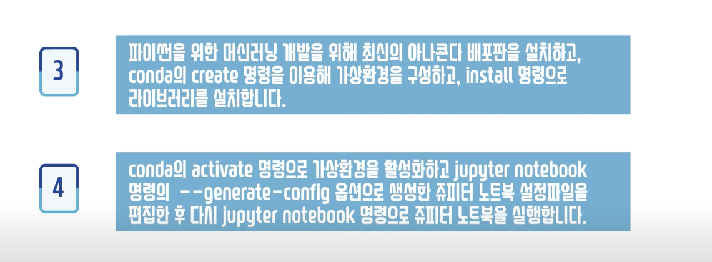

# 01강. 머신러닝

## 머신러닝의 개요
기존의 프로그램은 직접 프로그래밍 언어를 이용해 정해 놓은 규칙을 수행하는 것인 반면 머신러닝은 프로그램이 데이터를 학습해서 스스로 규칙을 만들어 수행하는 것

## 머신러닝이란?
- 데이터로부터 학습하도록 컴퓨터를 프로그래밍하는 분야
- 관측된 패턴을 일반화하거나 주어진 샘플을 통해 새로운 규칙을 생성하는 목표를 가짐
- 과거 경험에서 학습을 통해 얻은 지식을 미래의 결정을 이용하는 컴퓨터 과학의 한 분야

## 머신러닝을 사용하는 이유
전통적인 접근 방법은 길고 복잡해지는 규칙으로 유지보수 비용이 점차 높아지는 단점이 있음.

머신러닝 도입 후 프로그램의 길이가 짧아지고, 대량의 데이터의 훈련으로 분류 정확도 높아짐.
또한 자동으로 변화에 적응하여 사람의 개입이 필요 없다.

비용, 적응성, 새로운 가치의 측면에서 매우 유용하다

## 머신러닝 기법의 분류

1. 지도학습

- 지도학습이란?
학습 데이터가 입력(특징 행렬)과 출력 (대상 벡터)쌍으로 제공됨. -> 레이블 데이터
- 학습목표는 입력 특징 행렬과 출력 대상 벡터를 매핑시키는 규칙을 찾는 것임
- 입력 특징 행렬에 대해 출력 대상 벡터가 알려져 있으므로 '지도'라 부름

- 해결할 수 있는 대표적인 문제
1) 회귀 : 연속형 수치 데이터 예측 (집 값, 중고차 가격, 주가 예측 등)

2) 분류 : 범주형 데이터인 클래스 레이블 예측 (스팸 메일 필터, 긍정/부정 감성분석, 채무 불이행 예측 등)

- 대표적인 알고리즘으로는 k-최근접 이웃, 선형 회귀, 로지스틱 회귀, 서포트 벡터 머신, 결정 트리와 랜덤 포레스트, 신경망

2. 비지도학습

- 비지도학습이란?
학습 데이터로 입력(특징 행렬)만 제공됨. -> 레이블 없는 데이터
- 입력 특징 행렬에 대한 출력 대상 벡터가 없으므로 '비지도'라 부름

- 해결할 수 있는 대표적인 문제
1) 군집 : 특집이 비슷한 것들 끼리 묶어 군을 만드는 것 (k-평균, 계층 군집 분석(HCA), 기대값 최대화 등)

2) 시각화와 차원축소 : 시각화 시 인간이 인지할 수 있는 차원(2차원 등)으로 축소하는 것
(주성분분석(PCA), 커널 PCA, 지역적 선형 임베딩(LLE), t-SNE)

3) 연관 규칙 학습 : 구매 경향성 규칙 발견 등 (장바구니 분석)
(Apriori, Eclat)

3. 강화 학습

- 강화 학습이란?
피드백을 이용하여 시스템이 어떤 목표를 달성하기 위해 동적인 조건에 적응하도록 함
- 학습하는 시스템(에이전트)이 환경 관찰 -> 액션 실행 -> "보상" 또는 "벌점"
- 시간이 경과하면서 가장 큰 보상을 얻기 위해 최상의 전략("정책")을 스스로 학습 ex) 자율주행자동차, 알파고

4. 준지도학습

- 준지도학습이란?
학습 데이터에 레이블이 일부만 있는 경우 활용,
데이터 세트 전체에 레이블을 붙이는데 고비용이 발생,
지도학습 + 비지도학습의 조합.

## 정리

