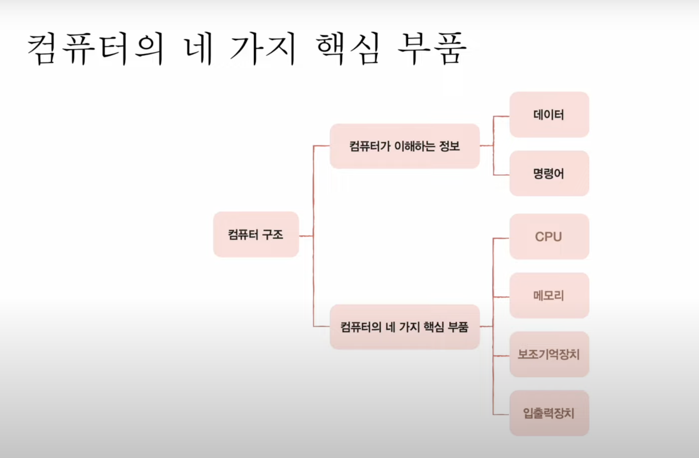

# 1-3강. 

# 컴퓨터가 이해하는 정보

- 데이터
- 명령어

# 컴퓨터의 4가지 핵심 부품

## CPU
메모리에 저장된 명령어를 읽어 들이고, 해석하고, 실행하는 부품.
내부에는 크게 ALU(계산기), 레지스터(임시 저장장치), 제어장치(제어 신호를 발생시키고 명령어를 해석하는 장치)로 이루어져있다.

## 메모리
(= 주기억장치,메인메모리,RAM)
현재 실행되는 프로그램(프로세스)의 명령어와 데이터를 저장하는 부품.
프로그램이 실행되기 위해서는 메모리에 저장되어 있어야 한다.
메모리에 저장된 값의 위치는 주소로 알 수 있다.

## 보조기억장치
전원이 꺼져도 보관될 정보를 저장하는 부품.

## 입출력장치
컴퓨터 외부에 연결되어 컴퓨터 내부와 정보를 교환할 수 있는 부품.

## 메인보드
시스템을 작동시키는 CPU나 램과 같은 핵심 부품을 장착할 수 있는 슬롯과 주변 장치를 연결할 수 있는 인터페이스를 제공하는 판이다.

메인보드(mainboard), 마더보드(motherboard 또는 mobo), 주회로 기판(main circuit board), 주 기판(base board), 플레이너 보드(planar board) 또는 시스템
보드(system board)는 범용 컴퓨터 또는 기타 다른 확장 가능한 시스템에 쓰이는, 주회로가 내장된 보드이다.

## 버스
컴퓨터의 부품끼리 정보를 주고받는 일종의 통로, 가장 핵심적인 통로는 시스템 버스라고 한다.

## SSD

솔리드 스테이트 드라이브(solid-state drive, SSD) 또는 솔리드 스테이트 디스크(solid state disk)는 반도체를 이용하여 정보를 저장하는 장치이다.

솔리드 스테이트 드라이브는 순수 전자식으로 작동하므로 기계식인 하드 디스크 드라이브(HDD)의 문제인 긴 탐색 시간, 반응 시간, 기계적 지연, 실패율, 소음을 크게 줄여 준다. 반면에 DRAM이 아닌 플래시 메모리가 적용된 SSD의 경우, 데이터 접근 시간이 아닌 연속적인 읽기와 쓰기에 대해 하드 디스크보다 속도가 낮은 경우가 대부분이었다. 하지만 최신 기술이 적용된 SSD의 경우, 대부분 하드 디스크 드라이브 이상의 읽기와 쓰기 속도를 낸다.

## GPU와 CPU의 차이
CPU(Central Processing Unit)는 명령어가 입력되는 순서대로 데이터를 처리하는 직렬처리방식에 특화된 구조.
GPU(Graphics Processing Unit)는 수천 개의 코어로 이뤄져서 여러 명령어를 동시에 처리하는 병렬 처리 방식, CPU보다 효율적인 코어로 구성되어 대규모 데이터를 병렬로 빠르게 처리할 수 있도록 최적화된 컴퓨팅 자원.

정리하자면 CPU는 복잡한 연산을 순서대로 빠르게 집중하는 반면, GPU는 쉽고 단순한 작업을 병렬적으로 대량 처리하는데 특화됨.

