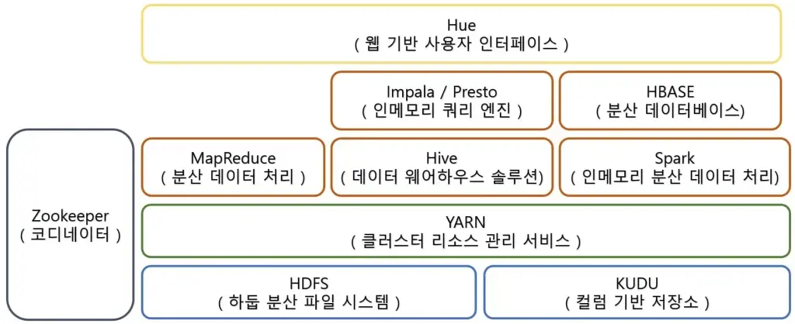

1. 하둡 에코 시스템(Hadoop eco system)이란?

Hadoop Eco System은 대략적으로 위의 그림과 같이 구성되어 있다.

1) HDFS(Hadoop distribute file system)
클러스터에서 데이터를 저장하는 역할을 하며
저장되는 모든 데이터는 128MB , 256MB로 나누어져 블럭이라는 단위로 저장되게 된다.
또한 이러한 블럭은 기본적으로 3copy가 되어 각기 다른 3개의 서버에 저장됨으로써
혹시나 한 개 또는 두개의 서버에 문제가 생기더라도 데이터의 유실을 방지해준다.

특징으로는 일반적인 하드웨어로 구성된 클러스터에서 실행되며 대용량 파일을 다룰 수 있도록 설계된 파일 시스템 입니다. 좀 더 상세한 특징은 아래와 같습니다.

- 아주 큰 용량의 데이터 저장 가능 : 여기서 아주 큰 용량의 데이터는 작게는 수백 메가바이트부터 크게는 수십 페타바이트 크기의 데이터를 이야기 합니다. 단일 장비가 아닌 클러스터에 분산 저장을 하기 때문에 클러스터 규모에 따라 수용 가능한 데이터의 크기가 달라지게 됩니다.

- 스트리밍 방식의 데이터 이용 : 한번의 쓰기 작업 이후에 여러 번 읽는 것이 가장 효율적이 데이터 이용 방식이라는 컨셉을 가지고 있기 때문에 HDFS로 저장된 데이터는 수정이 불가능한 특징을 가지고 있습니다. 데이터를 수정하고 싶다면 현재의 데이터를 삭제 후 수정된 데이터를 다시 저장해야 합니다.(단, 마지막 데이터에 추가로 데이터를 이어서 붙이는 것은 가능합니다.)

- 일반적인 하드웨어 사용 : 하둡 에코 시스템을 구성하기 위한 하드웨어는 특별한 성능이나 안정성이 요구 되지 않습니다. 물론 쾌적하게 사용하기 위한 권장 사항은 있습니다. 그러나 하둡은 높은 내고장성(Fault Tolerance)을 보장하기 때문에 일반적인 하드웨어를 사용하여도 데이터 유실에 대한 가능성이 매우 적기 때문에 반드시 뛰어난 안정성을 가진 하드웨어가 필요하지 않습니다.

- 파일 블록으로 저장 : 블록이라는 단위의 수 많은 파일들로 데이터가 저장 됩니다. 일반적인 블록의 크기는 128MB이며 좀 더 큰 용량의 데이터를 저장하는 경우에는 256MB의 블록 크기를 사용하기도 합니다

- 고가용성 : 앞서 언급했듯 마스터 역할을 하는 네임노드가 손상되었을 경우 해당 클러스터의 모든 데이터를 유실하게 됩니다. 이를 방지하기 위해 네임노드는 HA(High Availability)를 지원합니다. 이는 Active – Standby 구조의 한쌍의 네임노드로 구성 됩니다. Active 네임노드에 장애가 발생할 경우 Standby 네임노드가 바로 역할을 이어받아 클러스터의 장애를 예방 합니다. 이러한 고가용성을 구현하기 위해 QJM(Quorum Journal Manager)가 설계되었고 QJM을 통해 네임노드간에 최신 상태의 edits log가 공유됩니다.
Standby 네임노드로 전환되는 작업은 Failover Controller에 의해 관리됩니다. 여러가지 방법으로 Failover Controller의 구현이 가능하지만 일반적으로 Zookeeper를 통해 구현됩니다. Failover Controller 프로세스는 네임노드로부터 상태정보를 전달하는 하트비트를 받아 각 네임노드의 상태를 파악하며, 장애가 발생시 정상 상태로 파악하고 있는 네임노드를 Active 네임노드로 변경합니다.

- 네임노드와 데이터노드 : HDFS클러스터는 Master 역할을 가지고 있는 네임노드와 Worker 역할을 가지고 있는 데이터노드로 구성되어 있습니다.
네임노드는 파일 시스템의 네임스페이스(Name Space)를 관리하며 모든 파일과 디렉터리에 대한 메타 데이터를 관리합니다. 또한 데이터노드에게 주기적으로 블록 위치 정보를 받아, 클러스터에 저장하고 있는 모든 블록이 어느 데이터 노드에 있는지 파악하고 있습니다. 이 메타 데이터는 FsImage와 EditsLog라는 파일로 네임 노드 로컬 디스크에 저장 됩니다.

데이터노드는 실질적으로 데이터를 저장하는 역할을 하며, 클라이언트나 네임노드의 요청에 의해 데이터를 저장 및 탐색합니다. 또한 하트비트(Heart Beat)를 통해 주기적으로 네임노드에게 각자의 상태 정보와 가지고 있는 블록의 위치 정보를 전달합니다. 데이터노드가 실질적으로 데이터를 소유하고 있지만 마스터 관계에 있는 네임노드가 손상될 경우 데이터노드가 가지고 있는 데이터는 읽거나 복구 할 수 없습니다.

2) Yarn
Hadoop 클러스터에서 다양한 분산 application job를 실행시키기 위한 자원을 관리해주는 프레임워크. Mapreduce, Spark, Hive 모두 yarn에서 리소스 관리를 하게 된다.

YARN은 수십, 수백 개의 노드로 구성된 Hadoop 클러스터에서 실행되는 수 많은 작업 Task들을 관리 및 스케쥴링하고 각각의 작업에 사용될 자원을 적절히 분산하여 관리해주는 기능을 수행

ARN은 ResourceManager, NodeManager, Timeline Server와 같은 장기 실행 데몬으로 구성되어 있으며

(1) Resource Manager
Master 역할을 하는 서비스로, 전체 클러스터에서 하나 또는 HA 구성을 하였을 경우에는 Active – Standby 구조로 단 두 개의 노드에서만 실행됩니다. 그리고 ResourceManager는 Scheduler와ApplicationsManager라는 두가지 주요 컴포넌트를 가지고 있습니다.
Scheduler는 용량(capacity)과 큐(queue)를 설정된 스케쥴링 정책에 기반하여 실행 중인 다양한 애플리케이션(Application)에 자원을 할당하는 역할을 합니다. Scheduler는 애플리케이션의 상태를 모니터링하거나 추적하지 않으며 실패한 작업을 다시 시작시키지도 않습니다. 단지 애플리케이션에 필요한 자원 요청에 따라 CPU, 메모리와 같은 자원을 컨테이너 기반으로 할당하는 역할만 합니다.
ApplicationsManager는 애플리케이션 제출을 수락하고 애플리케이션 별 ApplicationMaster를 실행하기 위한 첫번째 컨테이너를 협상하며, 실패시 ApplicationMaster 컨테이너를 재시작하는 서비스를 제공합니다. 애플리케이션별 ApplicationMaster는 Schdeuler와 적절한 자원의 컨테이너를 협상하며 상태를 추적하고 진행 상황의 모니터링을 수행 합니다.

(2) Node Manager
Worker 역할을 하는 서비스로 ResourceManger가 실행되는 노드 이외의 노드에서 실행됩니다. 일반적으로는 Datanode가 실행되고 있는 노드와 동일한 노드에서 실행됩니다.
ResourceManager에게 주기적인 Heartbeat를 전달하여 상태 정보를 전달합니다.
ResourceManager에게 할당 받은 컨테이너의 자원 사용량을 감시하고 컨테이너에 할당된 자원보다 많이 사용하게 될 경우 ResourceManager으로부터 해당 컨테이너를 종료시키라는 명령을 받아 수행합니다.

(3) Timeline Server
애플리케이션이나 MapReduce와 같은 프레임워크의 정보를 수집하고 검색합니다. MapReduce의 경우 Map 작업 수, Reduce 작업 수, 카운터 등의 정보가 해당 됩니다.
Queue-name, 사용자 정보, 컨테이너 정보 등에 대한 데이터를 유지합니다.

3) Hive 
Hadoop 기반의 데이터 웨어하우스 솔루션으로 분산 저장된 데이터를 마치 DB에서 사용하듯 데이터를 모델링하고 프로세싱할 수 있게 해준다.

4) Spark
인메모리 방식의 대용량 데이터 처리를 위한 분산 처리 엔진으로 인메모리라는 특징을 가지고 있어 비교적 빠른 처리 속도를 보여준다. 또한 Scala, Java, Python 등 다양한 언어로 개발이 가능하다.

+ In-memory 연산을 가능하도록 하여 디스크 기반의 Hadoop에 비해 성능을 약 100배 정도 끌어올렸다.